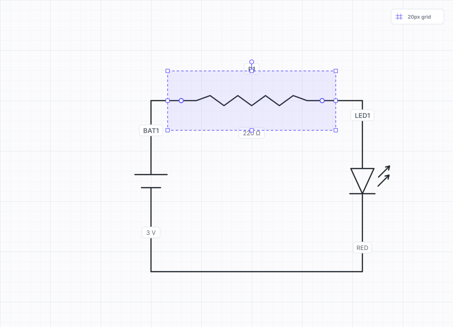

# Sketch2Schematic AI

Browser-first electrical schematic recognition and editing built with React, PixiJS, ONNX Runtime Web, OpenCV/WASM, Tesseract, and a circuit-graph model.

> **Project status:** experimental prototype. Recognition results must be reviewed before engineering use. A trained circuit-symbol ONNX model is not included in the repository.



## Features

- Draw a circuit with mouse, pen, or touch.
- Upload printed, colored, monochrome, or handwritten circuit images.
- Render and edit the corrected schematic on a PixiJS/WebGL canvas.
- Pan, zoom, move components, rotate symbols, and reconnect ports.
- Detect components with a custom YOLO model exported to ONNX.
- Run ONNX inference in the browser with WebGPU-first and WASM fallback.
- Detect wires with OpenCV.js/WASM and the built-in geometry recognizers.
- Read references and values with Tesseract.js OCR.
- Reconstruct ports, nets, junctions, open terminals, and connected wires.
- Export SVG/PNG and save editable JSON projects.
- Fall back to color, monochrome, structured-IEC, and vector heuristics when no AI model is loaded.

## Technology stack

| Layer | Technology | Responsibility |
|---|---|---|
| UI | React | Controls, review workflow, model loading, settings |
| Editor | PixiJS | WebGL rendering, pan/zoom, selection, dragging |
| Component detection | YOLO → ONNX | Symbol bounding boxes and classes |
| Browser inference | ONNX Runtime Web | WebGPU execution with WASM fallback |
| Wire detection | OpenCV.js/WASM | Thresholding, edges, Hough line extraction |
| OCR | Tesseract.js | References and component values |
| Graph reconstruction | Local JavaScript model | Ports, nets, junctions, terminals, snapping |
| Fast fallback | Rust-compatible WASM core | Lightweight line extraction |

## Quick start

Requirements:

- Node.js 20 or newer
- npm 10 or newer
- A current Chrome, Edge, Firefox, or Safari browser

```bash
npm install
npm run dev
```

Open the local URL printed by Vite.

### Production build

```bash
npm run build
npm run serve:dist
```

The local production server is normally available at `http://127.0.0.1:4173`.

## AI model setup

The repository includes the browser inference pipeline, model loader, labels manifest, and training scripts. It does **not** include trained YOLO weights.

Place your exported model here:

```text
public/models/circuit-yolo.onnx
public/models/labels.json
```

A model can also be selected at runtime through the application UI.

See:

- [AI pipeline](docs/ai-pipeline.md)
- [Model contract](docs/model-contract.md)
- [Model training](docs/model-training.md)

## Tests

Run the portable CI test suite:

```bash
npm test
```

Run tests and the production build:

```bash
npm run check
```

Individual regression tests are available for:

- vector drawing recognition;
- color image recognition;
- structured IEC recognition;
- capacitor/SCR/zener classification;
- active recognition settings;
- circuit graph movement;
- WASM line detection;
- AI labels manifests.

## Repository map

```text
.
├── .github/                 GitHub Actions and contribution templates
├── docs/                    Architecture, setup, AI and deployment guides
├── public/
│   ├── models/              ONNX model location and labels manifest
│   ├── samples/             Recognition fixtures
│   └── tessdata/            Local OCR language data
├── scripts/                 Regression tests, WASM build, local server
├── src/
│   ├── ai/                  YOLO, ONNX, OpenCV and OCR pipeline
│   ├── components/          React and PixiJS UI components
│   ├── config/              Application metadata
│   ├── hooks/               React hooks
│   ├── utils/               Recognition, graph and symbol libraries
│   ├── wasm/                Bundled browser WASM binary
│   └── workers/             Image-recognition Web Worker
├── training/                Ultralytics training and ONNX export scripts
└── wasm-core/               Portable line-detection source
```

More detail: [Project structure](docs/project-structure.md).

## Documentation

- [Documentation index](docs/README.md)
- [Getting started](docs/getting-started.md)
- [Architecture](docs/architecture.md)
- [AI pipeline](docs/ai-pipeline.md)
- [Circuit graph](docs/circuit-graph.md)
- [Recognition settings](docs/recognition-settings.md)
- [Deployment](docs/deployment.md)
- [Publishing on GitHub](docs/github-setup.md)
- [Troubleshooting](docs/troubleshooting.md)
- [Roadmap](docs/roadmap.md)

## Contributing

Read [CONTRIBUTING.md](CONTRIBUTING.md) before opening a pull request. Bug reports should include the source image, expected components, actual components, browser version, and recognition settings.

## Security and privacy

Recognition runs locally in the browser by default. Review [SECURITY.md](SECURITY.md) for reporting vulnerabilities and [docs/privacy.md](docs/privacy.md) for the data-flow summary.

## License

Project source is released under the [MIT License](LICENSE). Third-party libraries, model files, OCR data, datasets, and trained weights retain their own licenses. See [THIRD_PARTY_NOTICES.md](THIRD_PARTY_NOTICES.md).
