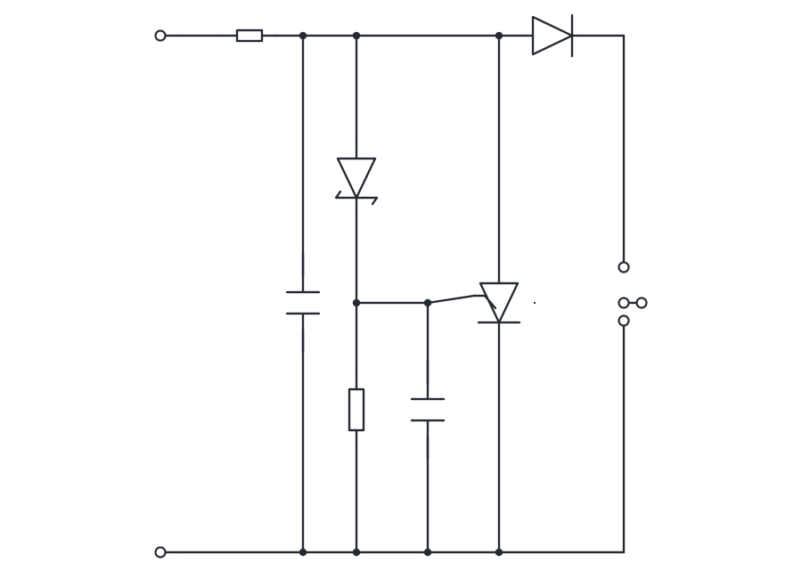

# Sketch2Schematic AI

Browser-first electrical schematic recognition and editing with React, PixiJS, ONNX Runtime Web, OpenCV/WASM, Tesseract, and circuit-graph reconstruction.



## What it does

Sketch2Schematic AI converts uploaded circuit images or mouse/pen drawings into an editable schematic. The result is rendered with PixiJS and can be panned, zoomed, corrected, relabeled, and exported.

The recognition pipeline combines:

- a fast bundled heuristic/WASM recognizer;
- optional YOLO component detection through ONNX Runtime Web;
- adaptive OpenCV wire extraction;
- optional Tesseract OCR for references and values;
- circuit-graph cleanup and port/net reconstruction.

> A trained `circuit-yolo.onnx` model is not included. Without one, the application uses the bundled heuristic recognizers and optional OpenCV/OCR stages.

## Version 7.2 performance update

Recognition now starts in **Fast** mode.

- Uploaded images are processed at a smaller safe working resolution.
- Tesseract OCR is disabled by default because it is normally the slowest first-run stage.
- OpenCV is skipped when the fallback recognizer has already found enough wires.
- YOLO and OpenCV can run concurrently.
- YOLO, OpenCV, and OCR results are cached for repeated analysis of the same image.
- Fixed-shape ONNX models still use their required input dimensions.
- The status bar reports the total recognition time.

Available profiles:

| Profile | Image preprocessing | OCR | Intended use |
|---|---:|---|---|
| Fast | up to 850 px | off by default | normal clean schematics |
| Balanced | up to 1100 px | optional | rough or medium-quality images |
| Accurate | up to 1400 px | optional | difficult, noisy, or low-resolution images |

See [Performance and recognition speed](docs/performance.md) for details.

## Quick start

Requirements: Node.js 20+ and npm 10+.

```bash
npm install
npm run dev
```

Open the local URL shown by Vite.

Production build:

```bash
npm run build
npm run serve:dist
```

## Add a YOLO ONNX model

Place these files in `public/models/`:

```text
public/models/circuit-yolo.onnx
public/models/labels.json
```

They can also be selected from the AI recognition panel at runtime.

Training helpers are available under `training/`. The expected model format is documented in [docs/model-contract.md](docs/model-contract.md).


## Train your own circuit detector

A complete end-to-end guide is included for preparing a YOLO-format dataset, checking annotations, training, validating, exporting ONNX, and running the model in the browser.

```bash
python -m venv .venv
source .venv/bin/activate        # Windows: .venv\Scripts\Activate.ps1
python -m pip install -r training/requirements.txt

npm run model:check-data
npm run model:train
npm run model:validate
npm run model:export
npm run dev
```

Start with [MODEL_TRAINING.md](MODEL_TRAINING.md), then use the detailed [model training guide](docs/model-training.md).

## Commands

```bash
npm run dev                 # development server
npm run build               # production build
npm run check               # all CI tests and production build
npm run test:performance    # performance-profile wiring test
npm run test:recognizer     # vector recognizer regression test
npm run test:iec            # IEC classifier regression test
npm run serve:dist          # serve the production build
npm run model:check-data     # validate YOLO dataset files and labels
npm run model:train          # train the detector
npm run model:validate       # evaluate best.pt
npm run model:export         # export/install ONNX and labels.json
```

## Repository structure

```text
src/
  ai/             ONNX, OpenCV, OCR, and pipeline integration
  components/     React interface and PixiJS editor components
  config/         application metadata and performance profiles
  utils/          heuristic recognition, graph cleanup, and exports
  wasm/           bundled recognition WebAssembly
  workers/        background image-recognition worker
public/
  models/         optional ONNX model and labels
  samples/        sample circuit images
  tessdata/       local OCR language data
docs/             architecture and operation documentation
training/         YOLO training/export helpers
scripts/          tests, build helpers, and repository tools
```

## Documentation

- [Documentation index](docs/README.md)
- [Architecture](docs/architecture.md)
- [AI pipeline](docs/ai-pipeline.md)
- [Performance](docs/performance.md)
- [Recognition settings](docs/recognition-settings.md)
- [Model contract](docs/model-contract.md)
- [Model training](docs/model-training.md)
- [Model training quick start](MODEL_TRAINING.md)
- [Circuit graph](docs/circuit-graph.md)
- [Deployment](docs/deployment.md)
- [Troubleshooting](docs/troubleshooting.md)

## Privacy

Recognition runs locally in the browser. Uploaded images are not sent to a project-controlled server. A deployment can still introduce third-party hosting or analytics, so review its configuration before publishing.

## Contributing and security

Read [CONTRIBUTING.md](CONTRIBUTING.md), [CODE_OF_CONDUCT.md](CODE_OF_CONDUCT.md), and [SECURITY.md](SECURITY.md) before opening a contribution or reporting a vulnerability.

## License

MIT. See [LICENSE](LICENSE) and [THIRD_PARTY_NOTICES.md](THIRD_PARTY_NOTICES.md).

## Version 7.5 engine isolation

The application now has four output modes:

- **Hybrid** — merge enabled engines with the heuristic fallback;
- **Heuristic/WASM only** — baseline symbols and wires;
- **YOLO-only components** — only YOLO supplies component symbols; heuristic wires remain;
- **OCR-only labels** — Tesseract only attaches references and values to heuristic symbols.

YOLO-only refuses to run without a trained ONNX model, so a missing model can no longer silently look like the heuristic result. OCR-only explicitly reports how many words were found and how many component labels/values were attached.

See [engine comparison](docs/engine-comparison.md).

