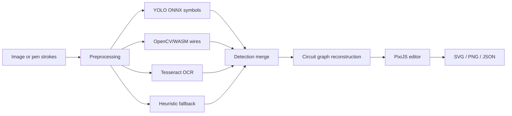

# Architecture

## High-level flow



## Design boundaries

### UI layer

React owns forms, toolbars, settings, model selection, status messages, and review controls. It does not draw the full schematic directly.

### Rendering layer

PixiJS owns the interactive schematic scene. Components are nodes with ports. Wires are graph edges whose endpoints follow connected components.

### Recognition layer

Recognition is modular. Any detector can contribute schematic candidates as long as it returns the shared object format.

### Domain layer

The circuit graph is the source of electrical connectivity. Coordinates alone are not considered sufficient proof that two objects are connected; endpoints are normalized and assigned to ports/nets.

### Worker boundary

Expensive image analysis is performed in a Web Worker where possible to keep the editor responsive.

## Object model

A component typically contains:

```js
{
  type: 'resistor',
  x: 320,
  y: 180,
  rot: 0,
  length: 120,
  confidence: 0.91,
  label: 'R1',
  value: '1 kΩ'
}
```

A wire contains:

```js
{
  type: 'wire',
  x1: 120,
  y1: 180,
  x2: 260,
  y2: 180,
  confidence: 0.96
}
```

See [Circuit graph](circuit-graph.md) for connectivity details.
